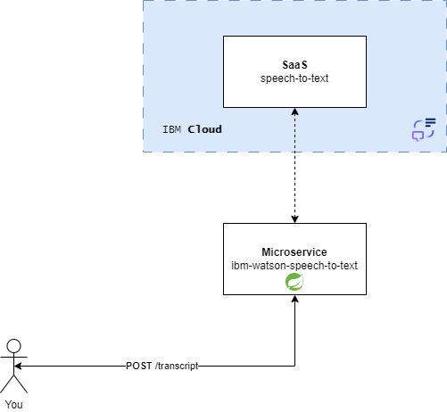
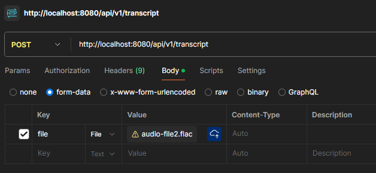

# What is IBM Watson Speech to Text?

IBM Watson® Speech to Text technology enables fast and accurate speech transcription in multiple languages for a variety of use cases, including but not limited to customer self-service, agent assistance and speech analytics. Get started fast with our advanced machine learning models out-of-the-box or customize them for your use case.


## PoC IBM Watson Speech to Text

A simple PoC of IBM **Watson** `SpeechToText` service.



## Requirements

- IBM Cloud account
- JDK >= v.11
- Apache Maven
- Your favorite IDE

## Activate IBM SpeechToText subscription

IBM Cloud offer Lite subscription for SpeechToText service, with a monthly limit of 500 minutes of audio transcription.


## Testing solution

When run application, a REST end-point is initialized. You can submit a simple test
audio [file (audio-demo.flac)](src/test/resources/audio/audio-demo.flac) to test the API

### Using CURL

```shell
curl --location 'http://localhost:8080/api/v1/transcript' --form 'file=@"/audio/audio-demo.flac"'
```

### Using Postman

- Crea new HTTP `POST` request and select `body` tab
- Choose `form-data` like payload type
- Add new `key` with name `file`
- Add [file (audio-demo.flac)](src/test/resources/audio/audio-demo.flac) as `value`



Independent of API call method you choose, if all work fine, you obtain the above response:

```json lines
{
  "text": "a line of severe thunderstorms with several possible tornadoes is approaching Colorado on Sunday "
}
```

## Links

- [IBM Cloud](https://cloud.ibm.com/)
- [IBM SpeechToText - API-docs](https://cloud.ibm.com/apidocs/speech-to-text?code=java#introduction)